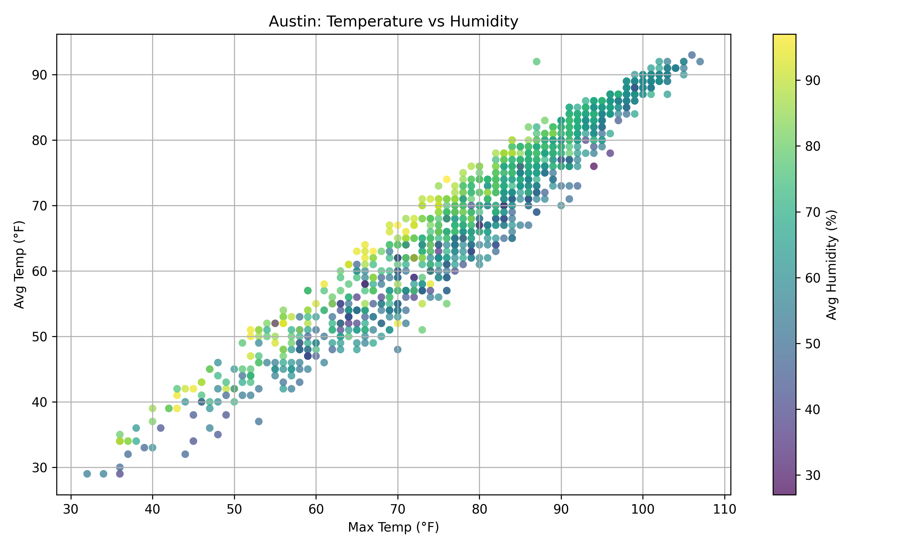

# Austin Weather EDA

## Project Overview

This project analyzes historical weather data from Austin, Texas, focusing on:

- Temperature dynamics
- Seasonal patterns
- Long-term climatic trends
- Year-over-year temperature validation

The analysis includes data cleaning, preprocessing, rolling statistics,
correlation analysis, and time-series visualization using Python-based
data analysis libraries.

---

## Temperature vs Humidity

The scatter plot below illustrates the relationship between maximum temperature
and average humidity in Austin.

---

## Dataset

[View Austin Weather Dataset](https://raw.githubusercontent.com/matzim95/ML-datasets/master/austin_weather.csv)

The dataset contains daily weather observations including:

- High, average, and low temperatures
- Humidity levels
- Dew point
- Date information

---

## Analysis Steps

1. Data loading and inspection
2. Data cleaning and type conversion
3. Handling missing values
4. Correlation analysis
5. Time-series visualization
6. Rolling and expanding averages
7. Seasonality analysis
8. Year-over-year temperature validation

---

## Key Insights

- Strong seasonal temperature cycles are observed.
- Summer months consistently show the highest average temperatures.
- No abrupt structural climate shifts were detected.
- A slight upward yearly temperature tendency is visible after filtering incomplete years.

### Quantitative Summary

- **Mean annual temperature:** 70.32 °F  
- **Highest yearly mean:** 71.63 °F  
- **Lowest yearly mean:** 69.28 °F  

---

## Tools Used

- Python
- Pandas
- NumPy
- Matplotlib
- Seaborn